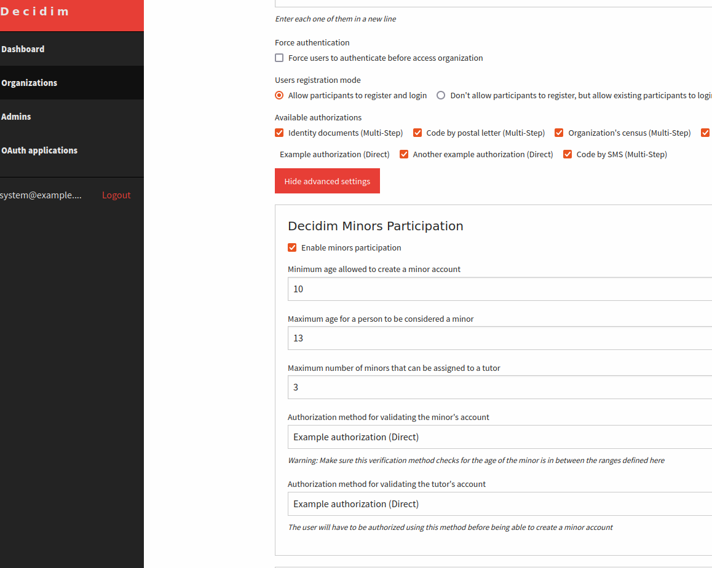
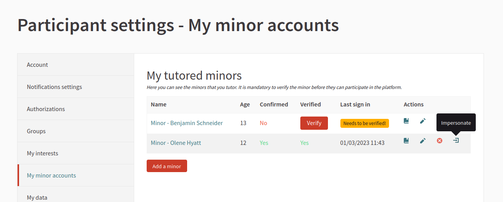
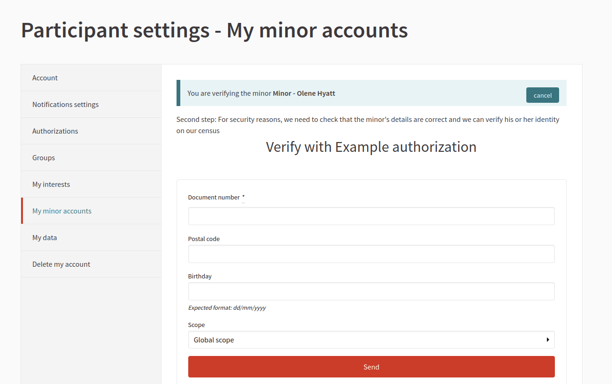
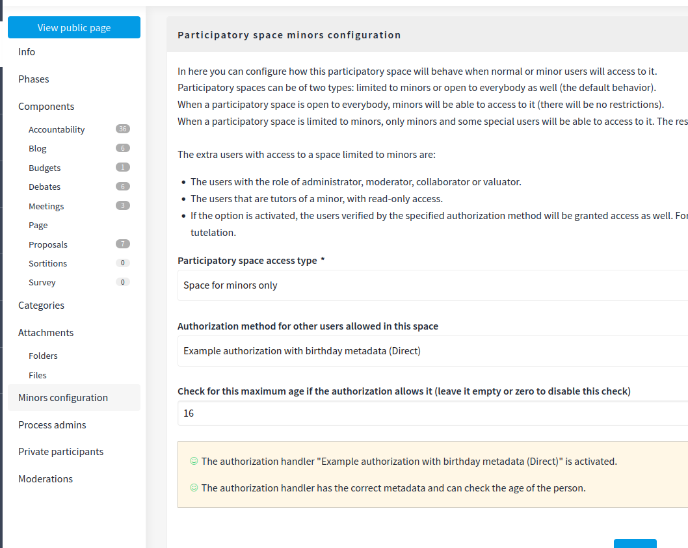
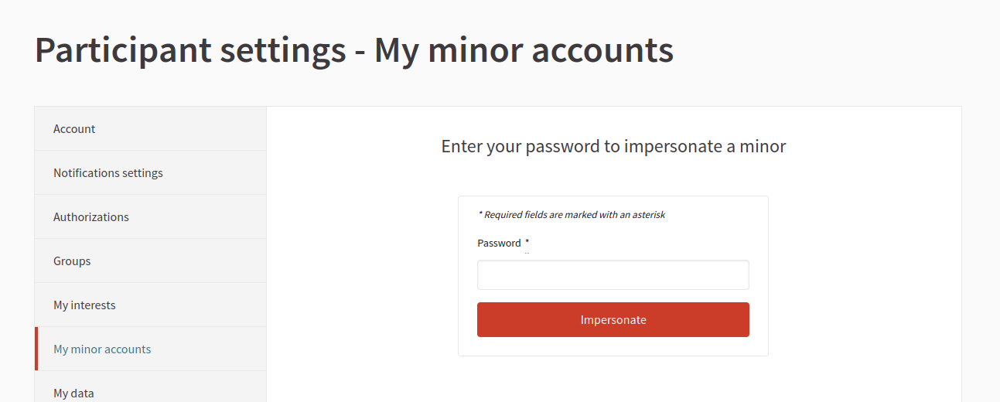
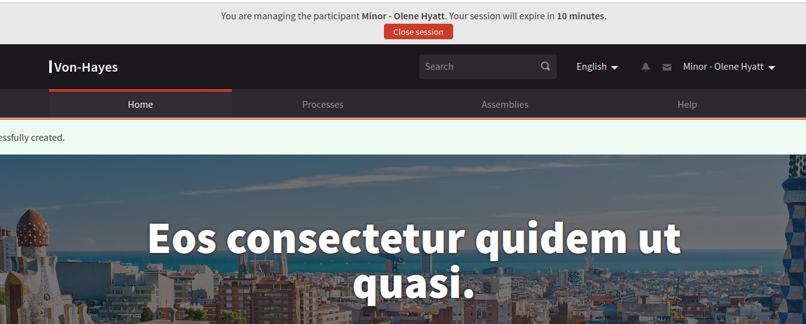

# Decidim for Kids module

[![[CI] Lint](https://github.com/AjuntamentdeBarcelona/decidim-module-kids/actions/workflows/lint.yml/badge.svg)](https://github.com/AjuntamentdeBarcelona/decidim-module-kids/actions/workflows/lint.yml)
[![[CI] Test](https://github.com/AjuntamentdeBarcelona/decidim-module-kids/actions/workflows/test.yml/badge.svg)](https://github.com/AjuntamentdeBarcelona/decidim-module-kids/actions/workflows/test.yml)
[](https://codeclimate.com/github/AjuntamentdeBarcelona/decidim-module-kids/maintainability)
[](https://codecov.io/gh/AjuntamentdeBarcelona/decidim-module-kids)
[](https://badge.fury.io/rb/decidim-kids)

Module developed by Barcelona City Council to promote kids participation.

> **IMPORTANT**:
>
> This module relies on the use of verification handlers. Security and minor protection will be as good as how good is the verification method in checking that a user is really a parent of a minor (or a tutor).
>
> **Use it under your own responsibility, nor the Barcelona City Council, neither any of the developers involved take any responsibility due the misuse of this piece of software.**

## Installation

Add this line to your application's Gemfile:

```ruby
gem 'decidim-kids'
```

 Or, if you want to stay to the latest version, specify the GIT repository:

```ruby
gem 'decidim-kids', git: "https://github.com/AjuntamentdeBarcelona/decidim-module-kids"
```

And then execute:

```
bundle
bundle exec rails decidim_kids:install:migrations
```

> NOTE: This module works better with an authorization methods capable of storing the user's birthday in the metadata.
> To install a, dummy, authorization method that stores the birthday in the metadata, you can run:
> `bundle exec rails decidim_kids:install:handlers`

## Usage

This module should work out of the box jut by adding it to your Gemfile.

However, if you wish to customize some of the default values, you can create an initializer and configure
any of the variables listed below:


```ruby
# config/initializers/decidim_kids.rb

Decidim::Kids.configure do |config|
  # If true, minor participation is enabled by default in any newly created organization
  config_accessor :enable_minors_participation do
    false
  end

  # Default value for the minimum age required for a minor in order to create an account
  config_accessor :minimum_minor_age do
    10
  end

  # Default value for the maximum age of a person to be considered a minor (1 year than this number will consider the user an adult)
  config_accessor :maximum_minor_age do
    13
  end

  # Default value maximum number of minors that can be assigned to a tutor
  config_accessor :maximum_minor_accounts do
    3
  end

  # If true, the tutor can impersonate a minor
  config_accessor :allow_impersonation do
    true
  end

  # Default authorization metadata attributes where the minor's birthday is stored
  # (if the authorization handler stores it)
  # If this value is present: In addition to the normal verification process for the minor, the
  #                           age of the minor returned by the validation will be enforced to be
  #                           between the minimum_minor_age and maximum_minor_age values.
  #                           Note that if the validation does not stores the birthday in one of these
  #                           attributes, the validation will always fail.
  # If this value is blank: No age checks will be performed (but the validation process might do it independently)
  config_accessor :minor_authorization_age_attributes do
    [:birthday, :date_of_birth, :birth_date, :birthdate]
  end
  
  # Other, more advanced, configuration options are available.
  # Check the source code at lib/decidim/kids.rb for more information.
end
```

## Promoting minor accounts to normal accounts

A minor account must be promoted in order to be converted into a normal, full-featured account. This must be performed externally by running a command.

There is a rake task that can be incorporated in daily cron to do just that automatically:

```
bundle exec rake kids:promote_minor_accounts 
```

We recommend to incorporate this along with the other cron commands required for Decidim. 

## Using authorizations

This module relies on the use of authorization handlers in order to detect if an user is a minor or not.

There are two ways that authorization are used:

1. In the organization's configuration (configured at `/system`). In here the "super-admin", needs to define what authorization methods will be used to authorize a user that can be a "tutor" (ie: can have minors in charge), or a "minor".
  In the case of a minor, the authorization handler should have a field in the form that asks the age of the person (ideally, it also should check that the person is a minor through some census service, but that's not mandatory). In this case, it is not required to store this date in the authorization's metadata.
2. In a participatory space that access restricted to minors, the authorization handler will be used to check if a normal user (not a minor) can also participate in such space. In this case, the authorization handler should store the birthday of the user in the authorization's metadata.

> NOTE: it is possible to define the name of the form fields that will be used to store the birthday of the user in the authorization's metadata. Check the source code at `lib/decidim/kids.rb` for more information.

## Screenshots

This plugin is configurable per-tenant in `/system`:


Users have a zone to manage their minors:


A minor needs to be verified to ensure the user is really the corresponding tutor:


A participatory space can be restricted to minors and an extra verification method that stores the age of the person (so you can define participatory spaces with mixed minors and adolescents that can participate together without any other external participants).


A minor can be impersonated by the tutor:



## Contributing

Bug reports and pull requests are welcome on GitHub at https://github.com/AjuntamentdeBarcelona/decidim-module-kids.

### Developing

Please see the extra notes on the design of this plugin at the [ARCHITECTURE](docs/ARCHITECTURE.md) document.

To start contributing to this project, first:

- Install the basic dependencies (such as Ruby and PostgreSQL)
- Clone this repository

Decidim's main repository also provides a Docker configuration file if you
prefer to use Docker instead of installing the dependencies locally on your
machine.

You can create the development app by running the following commands after
cloning this project:

```bash
$ bundle
$ DATABASE_USERNAME=<username> DATABASE_PASSWORD=<password> bundle exec rake development_app
```

Note that the database user has to have rights to create and drop a database in
order to create the dummy test app database.

Then to test how the module works in Decidim, start the development server:

```bash
$ DATABASE_USERNAME=<username> DATABASE_PASSWORD=<password> bin/rails s
```

Note that `bin/rails` is a convinient wrapper around the command `cd development_app; bundle exec rails`.

In case you are using [rbenv](https://github.com/rbenv/rbenv) and have the
[rbenv-vars](https://github.com/rbenv/rbenv-vars) plugin installed for it, you
can add the environment variables to the root directory of the project in a file
named `.rbenv-vars`. If these are defined for the environment, you can omit
defining these in the commands shown above.

#### Webpacker notes

As latests versions of Decidim, this repository uses Webpacker for Rails. This means that compilation
of assets is required everytime a Javascript or CSS file is modified. Usually, this happens
automatically, but in some cases (specially when actively changes that type of files) you want to
speed up the process.

To do that, start in a separate terminal than the one with `bin/rails s`, and BEFORE it, the following command:

```
bin/webpack-dev-server
```

#### Code Styling

Please follow the code styling defined by the different linters that ensure we
are all talking with the same language collaborating on the same project. This
project is set to follow the same rules that Decidim itself follows.

[Rubocop](https://rubocop.readthedocs.io/) linter is used for the Ruby language.

You can run the code styling checks by running the following commands from the
console:

```
$ bundle exec rubocop
```

To ease up following the style guide, you should install the plugin to your
favorite editor, such as:

- Atom - [linter-rubocop](https://atom.io/packages/linter-rubocop)
- Sublime Text - [Sublime RuboCop](https://github.com/pderichs/sublime_rubocop)
- Visual Studio Code - [Rubocop for Visual Studio Code](https://github.com/misogi/vscode-ruby-rubocop)

#### Non-Ruby Code Styling

There are other linters for Javascript and CSS. These run using NPM packages. You can
run the following commands:

1. `npm run lint`: Runs the linter for Javascript files.
2. `npm run lint-fix`: Automatically fix issues for Javascript files (if possible).
3. `npm run stylelint`: Runs the linter for SCSS files.
4. `npm run stylelint-fix`: Automatically fix issues for SCSS files (if possible).

### Testing

To run the tests run the following in the gem development path:

```bash
$ bundle
$ DATABASE_USERNAME=<username> DATABASE_PASSWORD=<password> bundle exec rake test_app
$ DATABASE_USERNAME=<username> DATABASE_PASSWORD=<password> bundle exec rspec
```

Note that the database user has to have rights to create and drop a database in
order to create the dummy test app database.

In case you are using [rbenv](https://github.com/rbenv/rbenv) and have the
[rbenv-vars](https://github.com/rbenv/rbenv-vars) plugin installed for it, you
can add these environment variables to the root directory of the project in a
file named `.rbenv-vars`. In this case, you can omit defining these in the
commands shown above.

### Test code coverage

If you want to generate the code coverage report for the tests, you can use
the `SIMPLECOV=1` environment variable in the rspec command as follows:

```bash
$ SIMPLECOV=1 bundle exec rspec
```

This will generate a folder named `coverage` in the project root which contains
the code coverage report.

### Localization

If you would like to see this module in your own language, you can help with its
translation at Crowdin:

https://crowdin.com/project/decidim-kids

## License

See [LICENSE-AGPLv3.txt](LICENSE-AGPLv3.txt).
