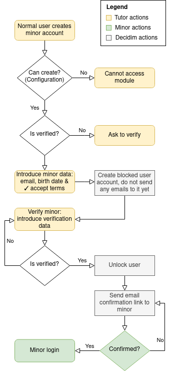

# Minors architecture

## Organization tweaks

...

## Minors an tutors definitions

1. A minor is a normal user that has a link in the table `minor_accounts`  (key `decidim_minor_id`). This table links two users, a tutor and a minor.
2. Similarly, a tutor is a normal user that has a link to the table `minor_accounts` (key `decidim_tutor_id`).

## Minors account creation workflow



1. A confirmed and verified (using the system's configured workflow) user account (that is not itself a minor, called a **tutor** from now on) can create a new minor account from the profile menu page.
2. The tutor introduces the minor's personal data (name, email, birth date), this data remains encrypted in the table `minor_accounts` in a JSONB field (`minor_data`).
3. After saving the data, a new user is created in the table `decidim_users` but blocked. No personal data will be stored in this user yet, except for the email. Attributes for the model will be: `blocked: true, blocked_at: Time.current, name: "Pending minor user"`. No emails are sent at this point (no confirmation or invitation emails).
4. Tutor can now click on the "verify minor" and is redirected to the authorization controller in order to verify the minor's data. This verification handler might ask for more personal data to authorize this user.
5. Depending on the configuration of the module (see `Decidim::Kids.minor_authorization_age_attributes`), check that the age returned by the verification is in the configured range. If not, remove the verification.
6. If the verification goes through, the `Authorization` gets stored, and the user is unblocked and personal data is transferred from the table `minor_accounts->minor_data` to the user created (the minor).
7. An email is sent to the new user (aka: confirm the email), once is confirmed it can log in (maybe automatically). A notification to the tutor will be sent when the minor confirms the email.


## Emancipation workflow

A minor account can be promoted to a normal user account by just removing the relationships existing in the `decidim_kids_minor_accounts` and `decidim_kids_minor_data`.

There is a rake task that can be incorporated in daily cron for instance to do just that automatically:

```
bundle exec rake kids:promote_minor_accounts 
```
